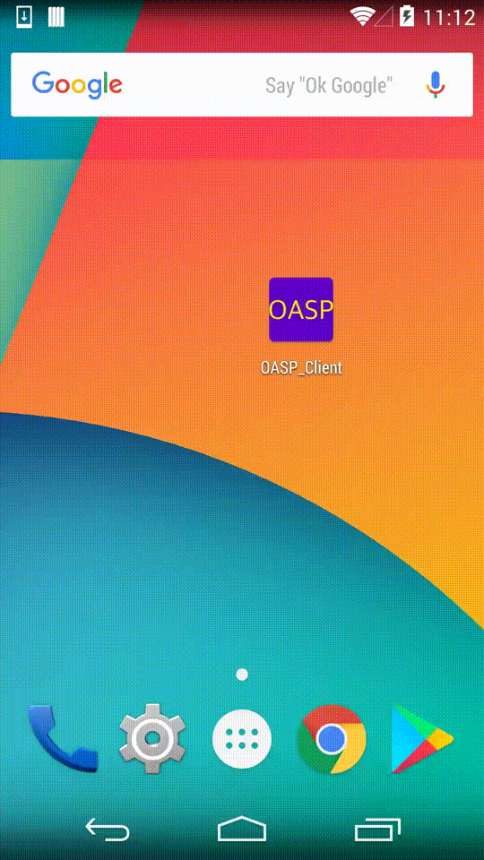

# Introduction

App signature is the fundation of the Android ecosystem. App developers must never lose the signing certificate/key and keep them secretly. However, we can always see misuses/abuses/leakages of the signing certs. Therefore, a new signing scheme is needed to allow developers to migrate to new signing certs, or at least allow them to "tag" apps signed by lost certificates.

So we proposed to add another layer of signature (IDSIG) above the existing App signature. It's a nested signature that helps to identify/differentiate apps signed by the same installation signature. The new scheme is absolutely compatible with the existing App verification/installation process, and solves the headache of developers who have to switch to new signing certificate but can't.

Based on the IDSIG, we also introduced OASP (Online App Status Protocol). App developers should carry OASP URLs (must be HTTPS) in the IDSIG certificate extension (similar to OCSP). Through this URL, everyone else in the ecosystem can submit app information to the developers and verify whether it's trustworthy or not. This makes possible to build an open collaborative platform where developers and device/security vendors are no longer isolated -- there will be no gap/barrier between them. 

For more details, one can directly refer to [our talk](mosec17.pdf) at [MOSEC 2017](http://mosec.org).

# Source Code Description

This repo contains a reference/demo implementation of OASP. Both client and server are provided. 

## client

This an Android app that scans over all installed apps. If an app supports IDSIG (signed with IDSIG), it will collects necessary info (package name, version code, SHA256, App signature, and IDSIG) and consult OASP server for the app's status (whether it can be trusted or not). Details about building and running the client can be found inside the client directory.

## server

An HTTPS server that serves OASP info. On GET, it replies with supported OASP protocol version; and on POST, it replies with apps' status. The specific policy to determine whether an app is good or bad is up to the app developers. And how to consume the OASP response is up to the device/security vendors. 

## prepare.sh

A bootsrap script to generate all the needed certificates/keys to play with the client and server. It generates three certificates/keys, one for the normal apk signing, one for the IDSIG signing, and the third for the OASP HTTPS server.

## oasp.cnf

prepare.sh generates the IDSIG signing cert/key based on this config file. It specifies each field of the certificate. Most importantly, it configs the OASP URL of the IDSIG certificate. We are temporarily reusing the OCSP extension to hold this URL in the certificate. It won't be a problem since the server should reply supported OASP protocol verson if it supports it besides OCSP. In the future if OASP is popularly adopted, we can consider to apply a dedicated OID for it.

## sign.sh

This is the tool to sign the app using both the normal apk signature and the IDSIG signature.

## tests

This directory contains test cases of the client and server. Please refer to the README inside the directory for details.

# How to Run

1. Modify oasp.cnf to adjust the certificate entities and the OASP URL (which should point to the machine where the OASP server will run).
2. Execute prepare.sh to generate the needed certificates/keys. It by default generates:
  * keystores/orig.p12: the cert/key used for the original apk signing
  * keystores/idsig.p12: the cert/key used for IDSIG signing
  * server/*.pem: the cert/key used by the HTTPS server
If you have your own cets/keys, please modify the script and place your certs/keys in the corresponding directories.
3. Assume your apk is placed in this directory as "sample.apk", run ./sign.sh sample.apk to sign it.
4. Follow the instruction in the client directory to build the client app, and install both sample.apk and client app on your device.
5. Launch the OASP server by executing server.py. Make sure that the HTTPS certificate can be trusted by your device, then enjoy!

# Demo

The demo video illustrates how the client works on Android devices. Although the video was taken on Nexus 5 with Android 4.4, the client app should be able to be compatible with older/newer platforms. The OASP protocol itself has no requirement of the Android version.

In this demo, the client scans over all installed apps. If one clicks on one of the apps, the client collects needed info and query the OASP server:
1. If the candidate does not support IDSIG/OASP, the client will treat the candidate in the traditional way (for example using traditional antivirus fingerprint matching mechanisms).
2. If the candidate has the IDSIG but not properly signed, the client will prompt alert.
3. If the candidate has properly signed IDSIG and valid OASP URL, the client will obtain the status code from the OASP server and make further decisions.

Note that in the demo video, all the three "My Application" apps have the same apk signature. The IDSIG plays a key role here to identify/differentiate them. 

# License

The code is under the BSD license. Please refer to the [LICENSE](LICENCE) file for details.

# Contacts

[Yulong Zhang](ylzhang@baidu.com)

[Lenx (Tao) Wei](lenx@baidu.com)

