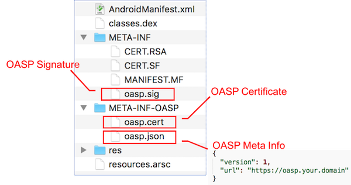
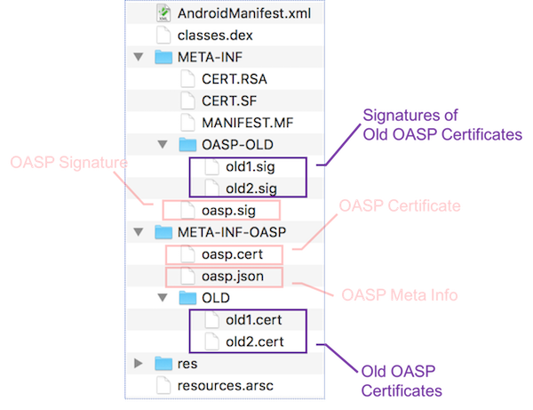

# Introduction

OASP's motivation and original design can be found in [our talk](mosec17.pdf) at [MOSEC 2017](http://mosec.org).

But the implementation has been improved ever since. The figure below lists files of an APK with OASP signature.

Files added by OASP are highlighted with callouts. A directory named as **META-INF-OASP** is added along with the traditional **META-INF** to store the OASP certificate and its meta info (which should at least contain the signing scheme version and the OASP url). The OASP signature corresponding to this OASP certificate is placed under the traditional **META-INF**. The OASP signature (**META-INF/oasp.sig**) is generated by signing **META-INF/MANIFEST.MF** using **META-INF-OASP/oasp.cert**.

In this design, the OASP certificate (and its meta info) is signed by the original APK certificate. The addition of its signature upon **MANIFEST.MF** won't break the original APK signing since the **META-INF** directory is out of the scope of the original APK signing.

# Security Considerations

Why the OASP certificate should be signed by the original APK certificate? Think this as an "endorsement" -- only the owner of the original APK certificate can prove that the OASP certificate is the authentic one; others cannot apply arbitrary OASP signatures upon the APK without breaking the original APK signature. 

So what would happen if the original APK certificate is leaked and the attacker inserts his/her own OASP certificate? That's why we need the OASP url for remote attestation. The remote server can tell whether a given OASP certificate indeed belongs to the developer. Then what if the attacker also replaces the OASP url? That's why the OASP url must be in HTTPS. Assuming your HTTPS certificate is not leaked at the same time, the attacker has no way to pretend as you to send OASP responses. Some may continue to ask: what if the attacker uses his/her own url together with a valid/matching HTTPS certificate of this malicious url? That's where "reputation" kicks in. The majority APKs of the same version in the wild should have the same OASP certificate; the minorities are certainly anomalies.

And what's the benefit of placing OASP signature in **META-INF** instead of **META-INF-OASP**? In our original [slides](mosec17.pdf), the OASP signature is also within the original certificate's signing scope. However, this unavoidably leads to an extra copy of the manifest (when OASP signs the APK, its own signature is not included in the manifest; when the original certificate signs the APK, the manifest contains an entry of the OASP signature). This duplication of manifest can lead to 100K to 1M APK file size increase (depending on the number of APK internal files and thus the number of entries in the manifest). To solve this problem, we move the OASP signature out of the original certificate's signing scope (into **META-INF**), without sacrificing the security guarantee (the original certificate is still "endorsing" the OASP certificate).

# Compatibility Considerations

OASP does not break the original APK signing/verification mechanism, so it is totally compatible to unmodified Android APK installation process.

However, OASP itself continues to evolve. The verifier and the remote OASP server should be aware of the OASP signing scheme that the target APK uses. This is why we add a mandatory field **version** in the **oasp.json** file. The verifier and the remote OASP server can take adaptive actions accordingly.

Moreover, developers may need to deprecate old OASP certificates and upgrade to a new one. This has been taken into consideration during OASP's design. The figure below illustrates an APK that has historical versions signed by two deprecated OASP certificates.

The verifier should check if the developer indeed owns the old certificates (by verifying the signatures with the same prefixes under the **META-INF/OASP-OLD** directory). Once passed, old versions of the APK signed by any of the old OASP certificates can be upgraded to this APK (assuming Android package installer is fine with other aspects of the APK). This design enables OASP to support cross-version upgrade.