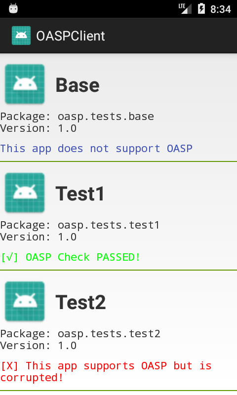
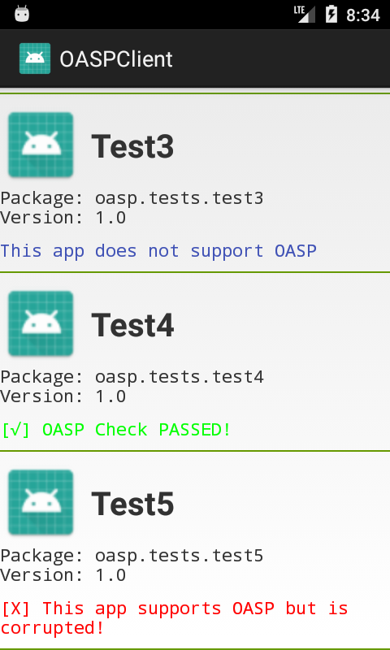

# Description of Test Cases

## Client-side Tests

### client.apk

This is a compiled version of the OASP client app provided in this repo.

### base.apk

The baseline APK without OASP support.

### test1.apk

This is an apk with OASP signature based on the base.apk. It can pass the OASP verification of the OASP client app provided in this repo.

### test2.apk

This is an apk with tampered OASP signature but valid apk signature. It can pass Android's apk verification (so it can be installed), but cannot pass the OASP client app's verification.

### test3.apk

An APK with valid OASP signature, but its URL is not in HTTPS.

### test4.apk

This is an apk with a valid apk signature and a valid OASP signature. It also has a valid OASP OLD signature. It can pass the OASP verification of the OASP client app, and can replace an old version that used OASP OLD certificate to generate the OASP signature. Note that the replacement/upgrade logic does not belong to the OASP client app; it is up to the device vendors to implement such logic into the Android framework. In the future we will provide a reference patch to the Android framework.

### test5.apk

This is an apk with a valid apk signature and a valid OASP signature. However, it has an invalid OASP OLD signature. It cannot pass the OASP verification process of the OASP client. This mimics the situation where an attacker wants to update an App signed by OASP OLD to a malicious app signed by OASP, without actually being the owner of OASP OLD private key.

### Running results

Screenshots below demonstrate the expected results:




## Server-side Tests

Here are some curl commands to test the server functions. If you are testing a server without valid SSL certificate, remember to add "-k/--insecure" to the curl commands.

### GET

```
curl https://[OASP_SERVER]
```

The server should return the supported OASP protocol version, like '{"oasp_version":1}'.

### POST

```
curl -X POST -d \
  '{ "apk_pkg":"com.yulong.app",
     "apk_ver":1,
     "apk_mf_hash":"C316183D78D89BFD2900E20FA90AB152AF21F89F0BF5C75749E14E743724C51F",
     "apk_cert":"6951C2D4BCB3457FC50314D4D05D69DD72E90EDCB06CDE1D9EB7D09D413F4B4C",
     "oasp_ver": 1,
     "oasp_cert":"CF802C91235D125EF0BF311BD3A0CDD4EDCB8BEB4F1DED5A6E0A05A98D77047A"}' \
  https://[OASP_SERVER]
```

The server should return the OASP status code, like '{"oasp_result":1}'.

You can try to remove some field or modify some field to invalid values, then the server should return '{"oasp_result":-3}'.

The current defined OASP status codes are:
* 0: Redirect
* 1: OK
* -1: Bad
* -2: Unknown
* -3: Invalid